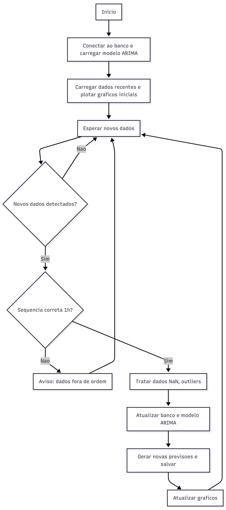

# 🌊 Sistema de Forecast Hidrológico 

Aplicação para **previsão de cotas do rio Lençóis** baseada em dados telemétricos e modelos ARIMA.  
O sistema integra dados reais e previsões em uma **interface web interativa**, atualizando automaticamente as séries conforme novos dados são inseridos.

## Fluxograma




---

## 📋 Descrição Geral

O sistema:
- Carrega do banco de dados as cotas observadas e previsões anteriores.
- Treina (ou atualiza) o modelo ARIMA com as últimas medições.
- Gera previsões para a próxima semana.
- Exibe na interface dois gráficos principais:
  - **Gráfico comparativo:** previsões x cotas observadas.
  - **Gráfico de previsões futuras.**
- Atualiza automaticamente os gráficos e o banco de dados quando novos dados são inseridos manualmente pelo operador.

---

## 🧠 Lógica do Sistema (Pseudocódigo)

```text
INICIO

1. Inicializar sistema
    - Conectar ao banco rio.db
    - Carregar modelo ARIMA salvo (se existir)
    - Obter timestamp atual

2. Carregar dados da ultima semana:
    - Buscar dados observados da tabela de cotas
    - Buscar previsoes correspondentes
    - Plotar grafico comparativo (observados + previsoes)
      -> funcao plot_comparativo()
    - Plotar grafico de previsoes futuras
      -> funcao plot_previsoes()

3. Loop continuo (aguardando novos dados):

    Aguardar evento de novo dado inserido pelo operador

    Quando novos dados forem detectados:
        timestamp_ultimo ← ultimo registro no banco
        timestamp_novo ← primeiro registro dos novos dados

        SE (timestamp_novo - timestamp_ultimo == 1 hora):
            - Tratar valores ausentes (NaN)
            - Tratar outliers
            - Atualizar tabela de dados observados no banco

            - Atualizar modelo ARIMA com novos dados (append)
            - Gerar novas previsoes para 7 dias
            - Atualizar tabela de previsoes no banco

            - Atualizar graficos:
                -> atualizar grafico comparativo (observados + previsoes)
                -> atualizar grafico de previsoes (somente previsoes futuras)

        SENAO:
            - Exibir aviso: "Dados fora de ordem. Aguardando sequencia correta."

    Retornar ao estado de espera por novos dados

FIM


